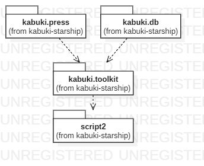

# [KabukiPress Cookbook](../readme.md)

## [Introduction](./readme.md)

### Organization and Build System

The core of the Kabuki Starship is the [**S**erial **C**hinese **R**oom, **I**nterprocess, and **T**elemetry (SCRIPT) Specification and Script2](../script2). Scirpt2 is designed to be the core for both Software and Firmware development kits, which is why it is called a nanoframework. [Kabuki Toolkit (KT)](../kt/readme.md) is a Software Development Kit that adds tools to make portable apps web servers. Projects are typically broken up into a Service, a Client app, a Website, and a Cookbook.

This book focuses on creation of the KabukiPress Service, Client app, Website, and this Cookbook, and contains a link to a tutorial video for that section.

#### Kabuki Packages

Kabuki Packages use a minimalist format where all of the library code is in the root folder, this help make including source code easier and keeps the clutter down. All source code files begin with either an underscore or alpha-numeric number, and project files start with two underscores; this allows you to sort the files you want to include into your Visual Studio or other IDE project by name so you can quickly drag and drop the files into your solution/project.

#### Project File Structure

The most basic file structure possible is the Script2 Bootstrap project that contains:

* <https://github.com/kabuki-packages/kabuki.bootstrap_script2.git>
  * `_seams` - This folder contains the software seams for the project.
    * `_main.cpp`, as the name implies, contains the entry point to the application.
    * `_impl.inl` - This file `#includes` all of the `.inl` inline implementation files into one translation unit.
    * `_debug.inl` - This file contains debug/test macros.
    * `_release.inl` - This file contains macros that are used when the package is not under test.
    * `_seams.inl` - This file contains the macros for the software seams the package.
    * `_undef.inl` - This file `#undef`the macros created in `_debug.inl` and `_release.inl`
    * `00.core.inl` - The unit test boilerplate code requires at least one software seam and you can rename this file to whatever you want.
    * `CMakeLists.txt` - This file builds `_main.cpp`.
    * `readme.md` - Every folder has a readme.md file in it because it is **EXTREMELY** useful.

**[<< Previous Section: Modern Embedded-C++](./modern_embedded_cpp.md) | [Next Section: Summary >>](../summary.md)**

## License

Copyright 2018-9 (C) [Kabuki Starship](https://kabukistarship.com); all rights reserved (R).

This is an open-source document, the Document, that was written by and contains intellectual property. The Document consists of documents, files, source code, technology design files, art, and other content contained this file, folder and markdown.cookbook GitHub repository located at <https://github.com/kabuki-starship/kabuki.press.cookbook>, the Repository. The Document is published under a generic non-commercial open-source license, the License, and is for educational and demonstration purposes only. You may use, reproduce, publicly display, and modify the Document so long as you submit and donate fixes and derived intellectual property, the Donated Ideas, to the Repository as an Issue ticket to become part of the Document. You may not sell the Document or otherwise profit from derivative works created from the Document without the expressed written permission of Your Name. Unless required by applicable law or agreed to in writing, the Document distributed under the License is distributed on an "AS IS" BASIS, WITHOUT WARRANTIES OR CONDITIONS OF ANY KIND, either express or implied.
